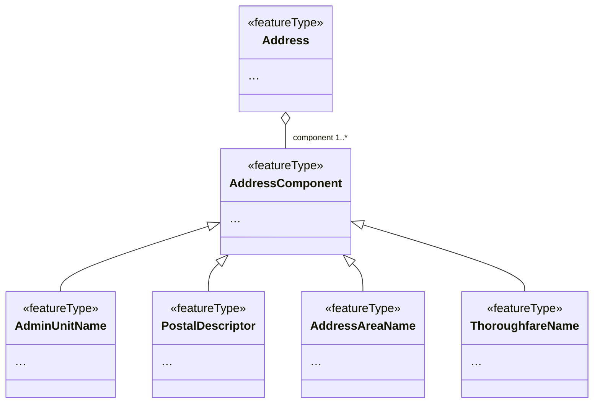
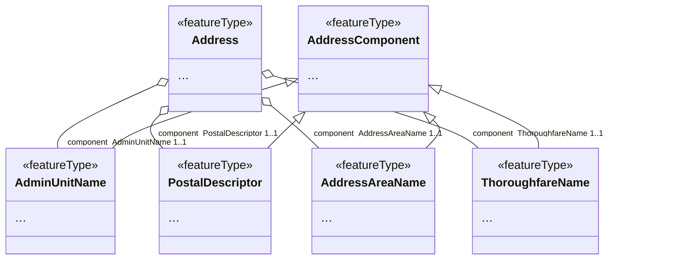

# Flatten Associated Components using Typenames (MT003)

## Category

simplification rule

## Description

Several INSPIRE themes, such as Transport and Addresses, use associations
to add a set of properties to a feature. An example for this is the
`components` in `Address` in the Addresses theme. This property has
a set of 1..n `AddressComponents` that together describe the actual
address. In a simplified model, we want to replace this construct with a
set of inlined properties. The individual components have a set of
properties that make them unique - the type of each property. We can
thus use those type names to create a new set of properties from the
original associated structures, like so:

- `component.ThoroughfareName`
- `component.PostalDescriptor`
- `component.AdminUnitName`
- `component.AddressAreaName`

If more than one occurrence of a specific type is present, it is
differentiated by using a numeric postfix. These start with "1":

- `component.AdminUnitName_1`
- `component.AdminUnitName_2`
- `component.AdminUnitName_3`

This rule effectively denormalizes such associations. Please note the
the individual properties such as `component_ThoroughfareName` are still
complex; there is a need for additional rules to also simplify these.

## Original model



## Transformed model



## Original instance in default GML encoding

```xml
<ad:Address gml:id="MIG20172_example_Address">
    <!-- ... -->
    <ad:component xlink:href="#ThoroughfareName_1"/>
    <ad:component xlink:href="#AddressAreaName_1"/>
    <ad:component xlink:href="#PostalDescriptor_1"/>
</ad:Address>
<!-- ... -->
<ad:ThoroughfareName gml:id="ThoroughfareName_1">
    <!-- ... -->
</ad:ThoroughfareName>
<ad:AddressAreaName gml:id="AddressAreaName_1">
    <!-- ... -->
</ad:AddressAreaName>
<ad:PostalDescriptor gml:id="PostalDescriptor_1">
    <!-- ... -->
</ad:PostalDescriptor>
```
   
## Transformed instance in default GML encoding

```xml
<ads:Address gml:id="MIG20172_example_Address">
    <!-- ... -->
    <ads:component_ThoroughfareName>
        <ad:ThoroughfareName gml:id="ThoroughfareName_1">
            <!-- ... -->
        </ad:ThoroughfareName>
    </ads:component_ThoroughfareName>
    <ads:component_AddressAreaName>
        <ad:AddressAreaName gml:id="AddressAreaName_1">
            <!-- ... -->
        </ad:AddressAreaName>
    </ads:component_AddressAreaName>
    <ads:component_PostalDescriptor>
        <ad:PostalDescriptor gml:id="PostalDescriptor_1">
            <!-- ... -->
        </ad:PostalDescriptor>
    </ads:component_PostalDescriptor>
</ads:Address>
``` 

## Model transformation rule

### Parameters

- `separator`: The character to use to separate the original property
  name from the type name of the components.
- `cardinality`: An optional map with type names and a number that
  indicates how many properties for a give type should be created.

### Execution

Create a new property for every possible associated type, using the
original property name, the separator, and the name of the element (i.e.
without a ...type suffix) to build the new property name.

## Instance transformation rule

### Parameters

None.

### Execution

For each potential type of a value, a property is created, so instance values can be copied. Properties that are left empty after copying the source values can be removed (see example above).

## Solved usability issues

Data where key properties are in associated objects is hard to style and to filter for in most desktop GIS and web GIS software. The inlined data can be processed much easier by many tools, e.g. it can be converted to Excel easily.

## Known usability issues

Since this rule denormalizes components, it can increase total data volume.

## INSPIRE compliance conditions and reversibility

This rule can only be applied if there is at maximum one occurrence of each type in a set of properties, i.e. where the components are a key-value map with the keys being defined by the type names.

## Notes

N/A