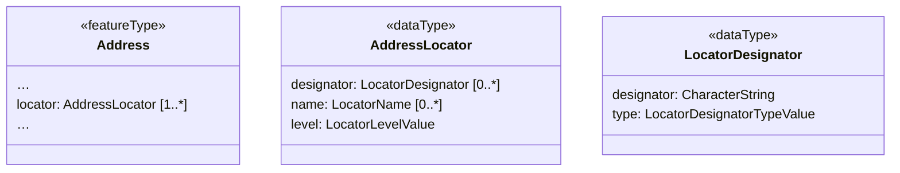
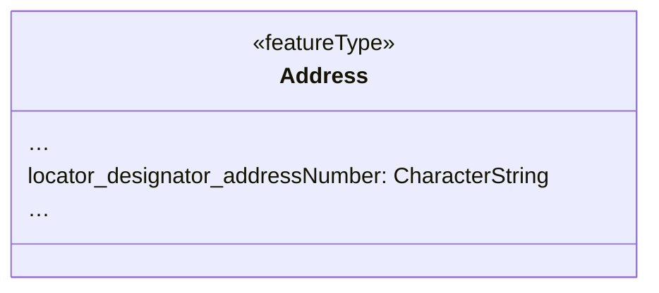

# Flatten aggregated or associated components using codelist values

## Category

General model simplification rules

## Description

Several INSPIRE themes, such as Addresses, use a soft type pattern to
add a set of properties to a feature. An example for this is the
`locator` in `Address` in the Addresses theme. This property has a set
of 1..n `AddressLocators` that together provides a human readable
designator or name of the actual address within the scope of the other
`AddressComponents`. Inside the `AddressLocators`, there are 0..n
`LocatorDesignator` objects. In a simplified model, we want to replace
this construct with a set of inlined properties. The individual
`LocatorDesignator` objects have a property that make them unique - the
value of the `type` of each `LocatorDesignator`, which comes from the
[Locator Designator Type
codelist](http://inspire.ec.europa.eu/codelist/LocatorDesignatorTypeValue).
We can thus use those codelist values (n.b. without the codelist
namespace) to create a new set of properties from the original
structures, like so:

- `locator.designator.addressNumber`
- `locator.designator.addressNumberExtension`
- `locator.designator.entranceDoorIdentifier`

Note that this rule only describes how to deal with components that have
a type property or other identifying property. In the example above, the
outer structure (the locator property) is also flattened. Furthermore,
the instance transformation rule needs to receive a parameter to
indicate which (simple) property of the property to use as a value (in
the running example, that would be the `designator` property).

## Original model



## Transformed model



## Original instance in default GML encoding

```xml
<ad:Address gml:id="MIG20172_example_Address">
    <!-- ... -->
    <ad:locator>
        <ad:AddressLocator>
            <ad:designator>
                <ad:LocatorDesignator>
                    <ad:designator>99</ad:designator>
                    <ad:type xlink:href="http://inspire.ec.europa.eu/codelist/LocatorDesignatorTypeValue/addressNumber">addressNumber</ad:type>
                </ad:LocatorDesignator>
            </ad:designator>
            <ad:level>unitLevel</ad:level>
        </ad:AddressLocator>
    </ad:locator>
    <!-- ... -->
</ad:Address>
```
   
## Transformed instance in default GML encoding

```xml
<ad:Address gml:id="MIG20172_example_Address">
    <!-- ... -->
    <ads:locator_designator_addressNumber>99</ad:locator_designator_addressNumber>
    <!-- ... -->
</ad:Address>
``` 

## Model transformation rule

### Parameters

- `separator`: The character to use to separate the original property
  name from the type name of the components.
- `keyProperty`: The name of the property from whose allowed values
  (Enumeration or Codelist) to take the new property names.

### Execution

Create a new property for every value in an associated code list, using
the original property name, the separator, and the name of the element
(i.e. without a ...type suffix) to build the new property name.

## Instance transformation rule

### Parameters

- `valueProperty`: The name of the property from which to take the value
  to be copied to the transformed instance.

### Execution

Copy the value of the `valueProperty` to the newly created property. If
the `valueProperty` is still a complex property, it might have to be
transformed using a different rule in addition.

## Solves usability issues

The flattened data can be filtered and symbolized easily in desktop GIS and web GIS software. The flattened data can be processed much easier by many tools, e.g. it can be converted to excel easily.

## Known usability issues

Flattening of large arrays will lead to a very large number of properties on the first level. Some software and formats can only work with a limited number of properties on a layer (ArcMap has 65.534, Shapefile is limited to 250), so this can limit usability in extreme cases. Some software also has limits on the length of property names (File Geodatabase = 64 characters, Shapefile = 10 characters).

## INSPIRE Compliance

This rule can only be applied if there is at maximum one occurrence of each codelist value for the type property in a set of properties.
