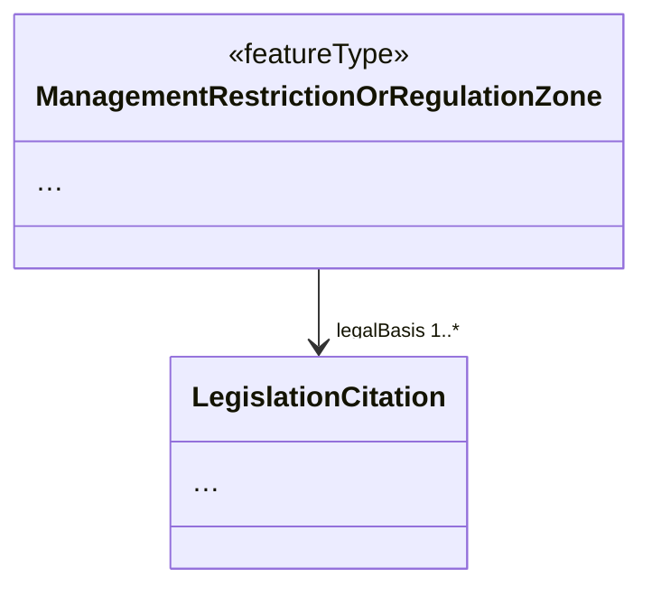
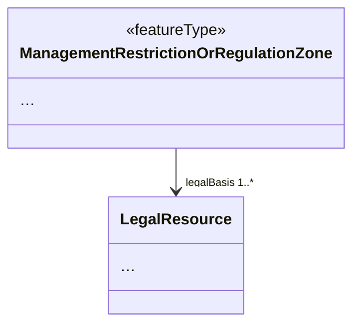

# Name

European Legislation Identifier

## Category

Alternative structures for specific types or type hierarchies

## Description

This model transformation replaces the LegislationCitation class from the Base Types 2 application schema by a class having the semantics of the LegalResource class as defined in the [European Legislation Identifier ontology](https://publications.europa.eu/en/web/eu-vocabularies/model/-/resource/dataset/eli).

This model transformation is intended to be used together with [Restriction of property encoding options to only by-reference](./PropertyByReferenceOnly.md) and followed by an encoding defined by the [European Legislation Identifier specification](https://eur-lex.europa.eu/eli-register/about.html).

## Original model



## Transformed model




## Original instances in default GML encoding

```xml
<am:ManagementRestrictionOrRegulationZone>
  <!-- ... -->
  <am:legalBasis xlink:href="#id56cff39d-27b6-4f5f-a79e-8e89db5bd788" />
  <!-- ... -->
</am:ManagementRestrictionOrRegulationZone>
<!-- ... -->
<base2:LegislationCitation gml:id="id56cff39d-27b6-4f5f-a79e-8e89db5bd788">
  <!-- ... -->
</base2:LegislationCitation>
```

## Transformed instance in default GML encoding

```xml
<am:ManagementRestrictionOrRegulationZone>
  <!-- ... -->
  <am:legalBasis xlink:href="https://www.retsinformation.dk/eli/lta/2019/315" />
  <!-- ... -->
</am:ManagementRestrictionOrRegulationZone>
```

## Transformed instance in RDF encoding

```xml
<eli:LegalResource rdf:about="https://www.retsinformation.dk/eli/lta/2019/315">
  <!-- ... -->
  <eli:date_publication rdf:datatype="http://www.w3.org/2001/XMLSchema#date">2019-03-30</eli:date_publication>
  <eli:is_realized_by rdf:resource="https://www.retsinformation.dk/eli/lta/2019/315/dan" />
  <eli:number rdf:datatype="http://www.w3.org/2001/XMLSchema#string">315</eli:number>
  <!-- ... -->
  <!-- See more properties on https://www.retsinformation.dk/eli/lta/2019/315.rdf -->
</eli:LegalResource>
```

## Model transformation rule

### Parameters

N/A

### Execution

Substitute the `LegislationCitation` type with `LegalResource`.

## Instance transformation rule

### Parameters

N/A

### Execution

Give the property that has `LegalResource` as type the ELI of the legal 
resource as value.

## Solves usability issues

Reduces implementation effort of and duplication of data by data 
providers, as legal resources usually are managed by another data 
provider.

## Known usability issues

Display of `@xlink:href` may not be supported in all
clients. However, this is the same problem as for code lists, which are
widely used in INSPIRE.

## INSPIRE Compliance

Fully compliant if the referenced resource is stored in an external 
register or non-INSPIRE online application.
