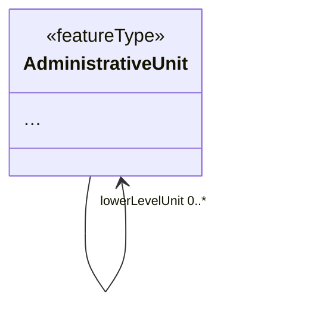
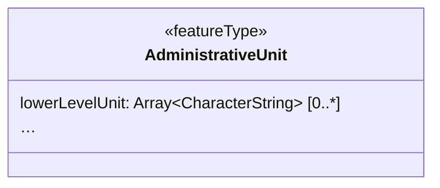

# Name

Extract Primitive Array

## Category

...

## Description

In some cases, direct flattening of high-cardinality properties will
lead to data usability issues further downstream in processes. At the
same time, at least some software such as QGIS supports arrays of simple
properties. This method can be used to extract the salient property of a
complex property and then create an array of those simple values. An
example where this can be applied is to store relationships between
objects:

- lowerLevelUnits: LinktoToUnit_01, LinktoToUnit_02, LinktoToUnit_03,
  ...


## Original model



## Transformed model



## Original instance in default GML encoding

```xml
<au:AdministrativeUnit gml:id="MIG20172_example_AdministrativeUnit">
    <!-- ... -->
    <au:lowerLevelUnit xlink:href="#MIG20172_example_AdministrativeUnit_low1"/>
    <au:lowerLevelUnit xlink:href="#MIG20172_example_AdministrativeUnit_low2"/>
    <au:lowerLevelUnit xlink:href="#MIG20172_example_AdministrativeUnit_low3"/>
    <!-- ... -->
</AdministrativeUnit>
```
   
## Transformed instance in alternative GeoJSON encoding

```json
{
  "lowerLevelUnit": [
    "MIG20172_example_AdministrativeUnit_low1",
    "MIG20172_example_AdministrativeUnit_low2",
    "MIG20172_example_AdministrativeUnit_low3"
  ]
}
``` 

## Model transformation rule

### Parameters

- `valueProperty`: The name of the property from which to take the
  values to be copied to the array in the transformed instance.

### Execution

The property name is left unchanged. Its implementation type is
transformed from its current type to either an array of the original
type if that type was simple, or to an array of the type of the
valueProperty. Note that when applied to the default GML encoding, this
rule by itself makes no difference to the encoding when not combined
with a concatenation/aggregation instance transformation.

## Instance transformation rule

### Parameters

- `valueProperty`: The name of the property from which to take the
  values to be copied to the array in the transformed instance.

### Execution

For each instance of the `valueProperty`, push its value to the array in
the target property. The order of values that are copied from the source
properties should be kept.

## Solves usability issues

This rule reduces overhead and makes it possible to have workable 
transformed data structures that are not polluted by hundreds or even 
thousands of properties. It also provides a good base for further 
simplification in case the target environment does not support arrays.

## Known usability issues

Some software cannot process arrays.

## INSPIRE Compliance

The transformed model is fully compliant to INSPIRE as long as no 
mandatory properties other than the valueProperty have been left out.
