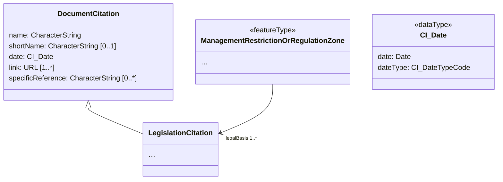
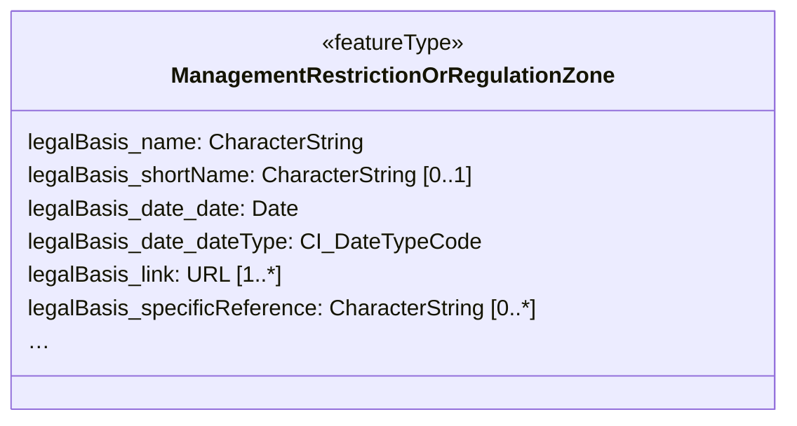

# Flatten Nested Structures (MT001)

## Category

simplification rule

## Description

The complex structure of model elements can be reduced by applying a 
flattening method. The principle of the flattening is to derive a flat 
model structure in the parent level by moving the first instance of 
nested child elements to its parent. The child element so moved to the 
parent can be renamed to represent the former (child) element path as a 
prefix in the name of the resulting element and to avoid naming 
conflicts.

When applied recursively, this method flattens the structure of multiple
 levels into the parent level and will result in properties such as 
these:

- `inspireId_namespace`
- `name_spelling_text`

This model transformation rule does not handle multiplicities greater 
than 1, i.e., it does not introduce multiple occurrences of child 
elements into the parent level; it thus does not introduce any numeric 
elements into the new property names. It also does not make use of the 
element names as they would be encoded in XML to keep the resulting 
property names shorter. In most cases outside the use of substitution 
groups, this does not lead to issues in property name length. Where 
issues do exist, they should be resolved using any of the following 
model transformation rules:

- [MT002 Extract Primitive Arrays](./ExtractPrimitiveArray.md)
- [MT003 Flatten Associated Components using Typenames](./AssociatedComponentsHardType.md)
- [MT004 Flatten Associated Components using Codelist Values](./AssociatedComponentsSoftType.md)

This model transformation rule does not retain additional occurrences 
that may exist in child elements.

## Original model



## Transformed model



## Original instance in default GML encoding

```xml
<am:ManagementRestrictionOrRegulationZone>
  <!-- ... -->
  <am:legalBasis>
    <base2:LegislationCitation>
      <base2:name>Bekendtgørelse af lov om skove</base2:name>
      <base2:shortName>LBK nr 122 af 26/01/2017</base2:shortName>
      <base2:date>
        <gmd:CI_Date>
          <gmd:date>
            <gco:Date>2017-01-26</gco:Date>
          </gmd:date>
          <gmd:dateType>
            <gmd:CI_DateTypeCode
              codeListValue="creation"
              codeList="http://standards.iso.org/iso/19139/resources/gmxCodelists.xml#CI_DateTypeCode" />
          </gmd:dateType>
        </gmd:CI_Date>
      </base2:date>
      <base2:link>http://www.retsinformation.dk/eli/lta/2017/122</base2:link>
      <base2:level
	    xlink:href="http://inspire.ec.europa.eu/codelist/LegislationLevelValue/national"
		xlink:title="national" />
    </base2:LegislationCitation>
  </am:legalBasis>
  <!-- ... -->
</am:ManagementRestrictionOrRegulationZone>
```
   
## Transformed instance in default GML encoding

```xml
<ams:ManagementRestrictionOrRegulationZone>
  <!-- ... -->
  <ams:legalBasis_name>Bekendtgørelse af lov om skove</ams:legalBasis_name>
  <ams:legalBasis_shortName>LBK nr 122 af 26/01/2017</ams:legalBasis_shortName>
  <ams:legalBasis_date_date>2017-01-26</ams:legalBasis_date_date>
  <ams:legalBasis_date_dateType.codeListValue>creation</ams:legalBasis_date_dateType.codeListValue>
  <ams:legalBasis_date_dateType.codeList>http://standards.iso.org/iso/19139/resources/gmxCodelists.xml#CI_DateTypeCode</ams:legalBasis_date_dateType.codeList>
  <ams:legalBasis_link>http://www.retsinformation.dk/eli/lta/2017/122</ams:legalBasis_link>
  <ams:legalBasis_linklevel>national</ams:legalBasis_linklevel>
  <ams:legalBasis_linklevel.href>http://inspire.ec.europa.eu/codelist/LegislationLevelValue/national</ams:legalBasis_linklevel.href>
  <!-- ... -->
</ams:ManagementRestrictionOrRegulationZone>
``` 

## Model transformation rule

### Parameters

- `separator`: The character to use to separate the original property name from the type name of the components.

### Execution

Recursively go down through the complex structure of the property and 
concatenate the local name of the property, using the `separator` 
character in between each local name.

This rule will drop inherited properties that have the same local name 
or same local name prefix as a property declared on the feature type or 
property type itself, e.g. `gml:name` vs. `gn:name`. Note that geometry 
properties are excluded from this rule.

## Instance transformation rule

### Parameters

None.

### Execution

As described above, this rule does not handle property occurrences 
greater than 1; if more than one instance of a property occurs, only the
 first instance will be kept in the parent.

## Solved usability issues

This rule deals with most nested property structures and flattens them 
into the parent structure, so that the data can be used easily in 
analysis and visualisation.

## Known usability issues

This rule may result in information loss where there are multiple 
occurrences in the child structure. The rule may be combined with others
 that reduce the likelihood of information loss.

This rule has no fixed limit in the character length of the resulting 
property names. Some of these names can get very long. The rule should 
thus be combined with others that reduce the likelyhood of that 
happening, such as [SimpleGeographicName](./SimpleGeographicName.html).

## INSPIRE compliance conditions and reversibility

Data transformed using this rule is INSPIRE compliant as long as there 
is no information loss from the source data. This can be achieved when 
either the cardinality of the source data is 0..1 for all affected 
properties or when additional rules are applied to retain additional 
child elements.

## Notes

Geometry properties are excluded from this rule.
