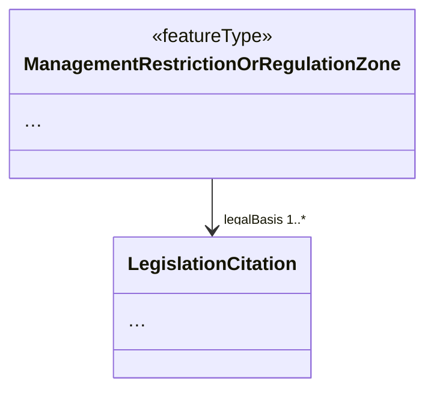

# Restriction of property encoding options to only by-reference

## Category

General model simplification rules

## Description

Information regarding certain types of resources is typically accessible through an external register or non-INSPIRE online application. Those resources should be referred to "by reference".

## Original model



Not visible on the diagram: the association end `legalBasis` has tagged value `inlineOrByReference` set to `inlineOrByReference`.

## Transformed model


Not visible on the diagram: the association end `legalBasis` has tagged value `inlineOrByReference` set to `byReference`.

## Original instance in default GML encoding

### Possibility 1: inline

```xml
<am:ManagementRestrictionOrRegulationZone>
  <!-- ... -->
  <am:legalBasis>
    <base2:LegislationCitation>
      <base2:name>Bekendtgørelse af lov om skove</base2:name>
      <base2:shortName>LBK nr 315 af 28/03/2019</base2:shortName>
      <base2:date>
        <gmd:CI_Date>
          <gmd:date>
            <gco:Date>2019-03-30</gco:Date>
          </gmd:date>
          <gmd:dateType>
            <gmd:CI_DateTypeCode
              codeListValue="publication"
			  codeList="http://standards.iso.org/ittf/PubliclyAvailableStandards/ISO_19139_Schemas/resources/codelist/ML_gmxCodelists.xml#CI_DateTypeCode" />
          </gmd:dateType>
        </gmd:CI_Date>
      </base2:date>
      <base2:link>http://www.retsinformation.dk/eli/lta/2019/315</base2:link>
      <base2:level
        xlink:href="http://inspire.ec.europa.eu/codelist/LegislationLevelValue/national"
        xlink:title="national" />
    </base2:LegislationCitation>
  </am:legalBasis>
  <!-- ... -->
</am:ManagementRestrictionOrRegulationZone>
```

### Possibility 2: by reference

```xml
<am:ManagementRestrictionOrRegulationZone>
  <!-- ... -->
  <am:legalBasis
    xlink:href="http://www.retsinformation.dk/eli/lta/2019/315"
    xlink:title="Bekendtgørelse af lov om skove" />
  <!-- ... -->
</am:ManagementRestrictionOrRegulationZone>
```

### Possibility 3: by reference and inline

From the GML standard:

> If both a link and content are present in an instance of a property element, then the object found by traversing the xlink:href link shall be the normative value of the property. The object included as content shall be used by the data recipient only if the remote instance cannot be resolved; this may be considered to be a "cached" version of the object.

```xml
<am:ManagementRestrictionOrRegulationZone>
  <!-- ... -->
  <am:legalBasis
    xlink:href="http://www.retsinformation.dk/eli/lta/2019/315"
    xlink:title="Bekendtgørelse af lov om skove">
    <base2:LegislationCitation>
      <base2:name>Bekendtgørelse af lov om skove</base2:name>
      <base2:shortName>LBK nr 315 af 28/03/2019</base2:shortName>
      <base2:date>
        <gmd:CI_Date>
          <gmd:date>
            <gco:Date>2019-03-30</gco:Date>
          </gmd:date>
          <gmd:dateType>
            <gmd:CI_DateTypeCode
              codeListValue="publication"
              codeList="http://standards.iso.org/ittf/PubliclyAvailableStandards/ISO_19139_Schemas/resources/codelist/ML_gmxCodelists.xml#CI_DateTypeCode" />
          </gmd:dateType>
        </gmd:CI_Date>
      </base2:date>
      <base2:link>http://www.retsinformation.dk/eli/lta/2019/315</base2:link>
      <base2:level
        xlink:href="http://inspire.ec.europa.eu/codelist/LegislationLevelValue/national"
        xlink:title="national" />
    </base2:LegislationCitation>
  </am:legalBasis>
  <!-- ... -->
</am:ManagementRestrictionOrRegulationZone>
```

## Transformed instance in default GML encoding

```xml
<ams:ManagementRestrictionOrRegulationZone>
  <!-- ... -->
  <ams:legalBasis
    xlink:href="http://www.retsinformation.dk/eli/lta/2019/315"
    xlink:title="Bekendtgørelse af lov om skove"
  />
  <!-- ... -->
</ams:ManagementRestrictionOrRegulationZone>
```

## Model transformation rule

### Parameters

- `referenceProperty`: The name of the property which to change to a
  reference.

### Execution

On the model level, this changes the tagged value `inlineOrByReference`
to have the value `byReference` on the property.

## Instance transformation rule

### Parameters

None.

### Execution

It is only possible to convert an instance using the "inline" pattern
when a URL to the related resource is present in the original data or
can be added upon transformation from the original data to the INSPIRE
data. This URL must be inserted in `@xlink:href`.

A name or title (e.g. "Bekendtgørelse af lov om skove"), or even a
full-blown bibliographic reference in the case of objects that are
information resources (e.g. "Bekendtgørelse af lov om skove. 28 marts
2019. LBK nr 315."), if present, may be inserted in `@xlink:title`.

## Solves usability issues

This rule reduces nested structures (inline referencing causes nested structures with many levels). It also reduces implementation effort of and duplication of data by data providers, if the value of the property is a resource managed by another data provider.

## Known usability issues

Display of `@xlink:href` and `@xlink:title` may not be supported in all
clients. However, this is the same problem as for code lists, which are
widely used in INSPIRE.

## INSPIRE Compliance

Fully compliant if the referenced resource is stored in an external register or non-INSPIRE online application.

