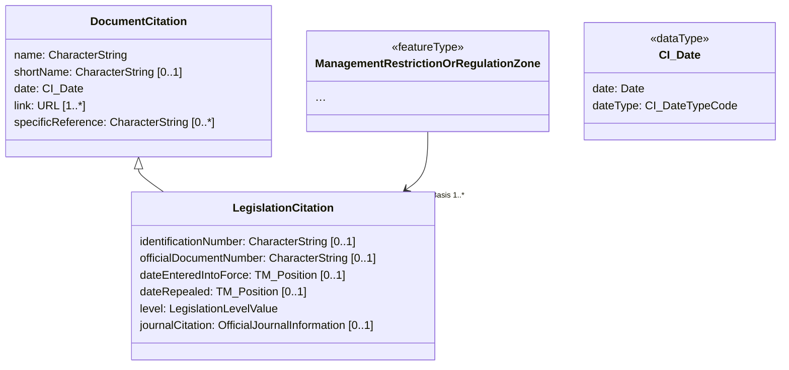
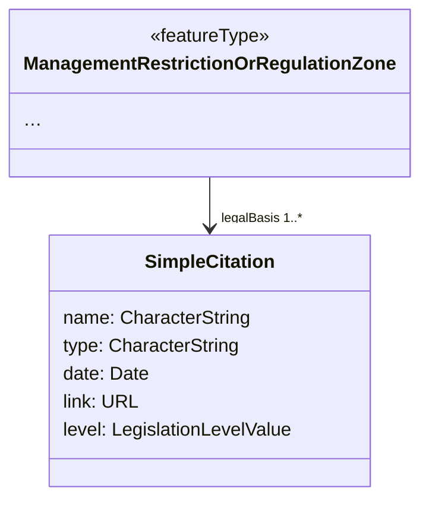

# Simplified Citation (MT007)

## Category

substitution rule

## Description

Citations are another element type that is used in many places 
throughout the INSPIRE data specifications. ISO 19115 defines 
`CI_Citation`, which has a very deep structure that tends to bury key 
information, creating a lot of overhead. INSPIRE introduced two base 
types to simplify citations, `LegislationCitation` and 
`DocumentCitation`. However, in certain places, `CI_Citation` is in use. 
This rule proposes a simplified alternative representation for 
`CI_Citation`. For consistency, it can also be used as a substitute to 
`LegislationCitation` and `DocumentCitation` when no external register 
is available.

The simplified citation is based on a link to an external publication
and adds minimal information with five properties:

- name
- type
- date
- link
- level

Each of these properties maps directly to an existing property of the
original citation types. The `type` property can be used to
indicate what kind of citation is represented by this object; its values
can be taken from the original type name, or can be based on a codelist.

## Original model



## Transformed model



## Original instance in default GML encoding

```xml
<am:ManagementRestrictionOrRegulationZone>
  <!-- ... -->
  <am:legalBasis
    xlink:href="http://www.retsinformation.dk/eli/lta/2017/122"
    xlink:title="Bekendtgørelse af lov om skove">
    <base2:LegislationCitation>
      <base2:name>Bekendtgørelse af lov om skove</base2:name>
      <base2:shortName>LBK nr 122 af 26/01/2017</base2:shortName>
      <base2:date>
        <gmd:CI_Date>
          <gmd:date>
            <gco:Date>2017-01-26</gco:Date>
          </gmd:date>
          <gmd:dateType>
            <gmd:CI_DateTypeCode
              codeListValue="creation"
              codeList="https://schemas.isotc211.org/schemas/19139/-/resources/codelist/gmxCodelists.xml#CI_DateTypeCode" />
          </gmd:dateType>
        </gmd:CI_Date>
      </base2:date>
      <base2:link>http://www.retsinformation.dk/eli/lta/2017/122</base2:link>
      <base2:level
        xlink:href="http://inspire.ec.europa.eu/codelist/LegislationLevelValue/national"
        xlink:title="national" />
    </base2:LegislationCitation>
  </am:legalBasis>
  <!-- ... -->
</am:ManagementRestrictionOrRegulationZone>
```
   
## Transformed instance in default GML encoding

```xml
<ams:ManagementRestrictionOrRegulationZone>
  <!-- ... -->
  <ams:legalBasis>
    <simple:SimpleCitiation>
      <simple:name>Bekendtgørelse af lov om skove</simple:name>
      <simple:type>LegislationCitation</simple:type>
      <simple:date>2017-01-26</simple:date>
      <simple:link>http://www.retsinformation.dk/eli/lta/2017/122</simple:link>
      <simple:level
        xlink:href="http://inspire.ec.europa.eu/codelist/LegislationLevelValue/national"
        xlink:title="national" />
    </simple:SimpleCitation>
  </ams:legalBasis>
  <!-- ... -->
</ams:ManagementRestrictionOrRegulationZone>
``` 

## Model transformation rule

### Parameters

N/A

### Execution

Substitute existing `CI_Citation`, `LegislationCitation` and 
`DocumentCitation` types with this `SimpleCitation` type.

## Instance transformation rule for LegislationCitation

### Parameters

N/A

### Execution

- Copy the value of `base2:name` to the property `simple:name`.
- Insert the element name `LegislationCitation` in the property
  `simple:type`.
- Copy the value of `base2:dateEnteredIntoForce` to the property
  `simple:date`.
- Copy the value(s) of `base2:link` to the property `simple:link`.
  Note that only one link may be present in the data.
- Copy the value of `base2:level` to the property `simple:level`.

## Solved usability issues

The transformed data structure can easily be edited, filtered and 
symbolized in desktop GIS and web GIS software. This transformation also
 reduces data volume.

## Known usability issues

None.

## INSPIRE compliance conditions and reversibility

This rule works only with one external link, and it removes finer 
grained information about dates. It can be combined with the 
[Restriction of property encoding options to only by-reference](./PropertyByReferenceOnly.md) rule to add more information from an 
external register.

## Notes

N/A