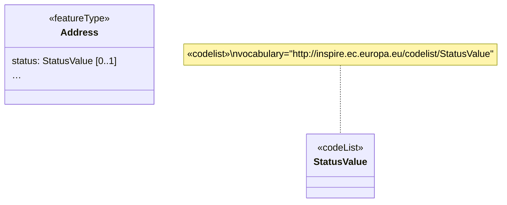
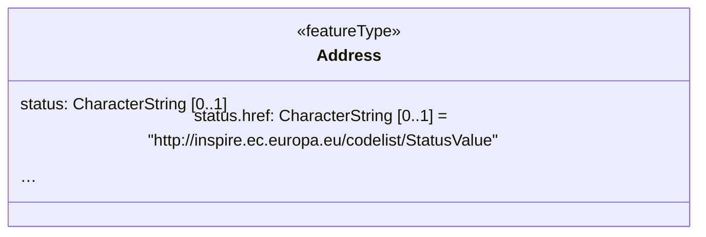

# Simplified Codelist Reference (MT008)

## Category

substitution rule

## Description

References to codelists are one of the ubiquitous characteristics of the
 INSPIRE data specifications. They are usually encoded in GML using a 
`gml:ReferenceType`, which uses [Xlink](https://www.w3.org/TR/xlink11/) 
components. In the conceptual model, they are represented using property
 types that point to UML classifiers with a `«Codelist»` stereotype.

The main usability issue with `gml:ReferenceType` is that all relevant 
information is encoded in the XLink attributes of the element. In 
particular, the actual external link is encoded in the `xlink:href` 
attribute, while additional information can be encoded in attributes 
such as `xlink:title`. An additional issue is that the actual, full 
codelist URLs are unwieldy to use for styling and filtering in most GIS 
software. It would be much preferable to use the local codelist values. 
There is a recommendation to encode these using the mentioned 
`xlink:title`, but no strict requirement.

This simplified codelist reference takes the property name and uses it 
to encode the label of the code list value directly, while all other 
properties are modelled as “subproperties”:

- `reference`
- `reference.href`

Both of these properties are mandatory in the `SimpleCitation`, while 
extra properties such as `xlink:arcRole`, `xlink:owns` and `xlink:type` 
are optional.

## Original model



## Transformed model



## Original instance in default GML encoding

```xml
<ad:Address gml:id="MIG20172_example_Address">
  <!-- ... -->
  <ad:status
    xlink:href="http://inspire.ec.europa.eu/codelist/StatusValue/current"
    xlink:title="current" />
  <!-- ... -->
</ad:Address>
```
   
## Transformed instance in default GML encoding

```xml
<ads:Address gml:id="MIG20172_example_Address">
  <!-- ... -->
  <simple:status>current</ads:status>
  <simple:status.href>http://inspire.ec.europa.eu/codelist/StatusValue/current</ads:status.href>
  <!-- ... -->
</ads:Address>
``` 

## Model transformation rule

### Parameters

- `property`: The property that has a codelist as type, e.g. `status`;
- `vocabulary`: The persistent URI identifying the values of the code 
list.

### Execution

- Change the type of `property` to `CharacterString`;
- Add an additional property
  - with name the name of `property` concatenated with the string 
`.href`;
  - with type `CharacterString`;
  - with default value `vocabulary`.

## Instance transformation rule

### Parameters

N/A

### Execution

- Copy the label of the code list value in the INSPIRE code list 
register to the property whose name is `property`;
- Copy the value of the `vocabulary` tagged value to the property whose 
name is `property` + `.href`.
  
## Solved usability issues

The transformed data structure can easily be edited, filtered and symbolized in desktop GIS and web GIS software.

## Known usability issues

None.

## INSPIRE compliance conditions and reversibility

Fully compliant.

## Notes

N/A