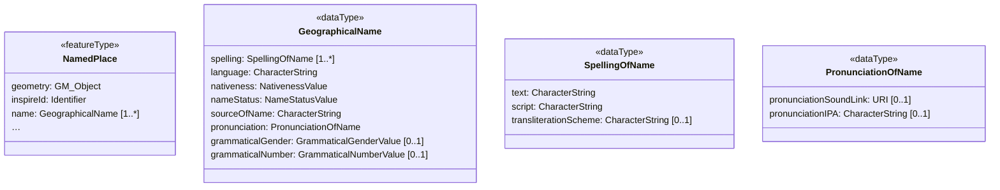
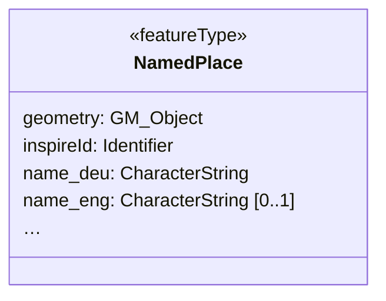

# Simplified Geographic Name

## Category

Alternate Structures for specific types or type hierarchies

## Description

Geographical Names are re-used throughout more than 20 INSPIRE themes overall, ranging from Cadastral Parcels and Addresses to Statistical Units. For many existing data sets, the `GeographicalName` type is overspecified, with very little information being unique to each instance. For cases where only minimal information on names is available, this simplified structure can be used. One key use case that is quite frequent, however, is to have names in more than one language. There are multiple official languages in more than half of the countries affected by INSPIRE.

The simplified name consists of one property per language, which will contain the `spelling.text` subproperty value of the original property:

- `name_deu`
- `name_fra`

For other properties of the original `GeographicalName`, such as `nameStatus` and `nativeness`, defaults may be documented in the dataset metadata.

## Original model



## Transformed model



## Original instance in default GML encoding

```xml
<gn:NamedPlace gml:id="MIG20172_example_NamedPlace">
	<gn:beginLifespanVersion xsi:nil="true"/>
	<gn:geometry>
		<gml:Point
		  gml:id="_d7180a8f-a590-44da-8b45-41d96d5cba5e"
		    srsName="http://www.opengis.net/def/crs/EPSG/0/25832"
			srsDimension="2">
		<gml:pos>471979.2568 5564594.2444</gml:pos>
		</gml:Point>
	</gn:geometry>
	<gn:inspireId>
		<base:Identifier>
			<base:localId>NamedPlace_Example</base:localId>
			<base:namespace>https://www.examples.eu/</base:namespace>
		</base:Identifier>
	</gn:inspireId>
	<gn:localType xsi:nil="true"/>
	<gn:name>
		<gn:GeographicalName>
			<gn:language>deu</gn:language>
			<gn:nativeness xsi:nil="true"/>
			<gn:nameStatus xsi:nil="true"/>
			<gn:sourceOfName xsi:nil="true"/>
			<gn:pronunciation xsi:nil="true"/>
			<gn:spelling>
				<gn:SpellingOfName>
					<gn:text>München</gn:text>
					<gn:script>Latn</gn:script>
				</gn:SpellingOfName>
			</gn:spelling>
		</gn:GeographicalName>
	</gn:name>
	<gn:name>
		<gn:GeographicalName>
			<gn:language>eng</gn:language>
			<gn:nativeness xsi:nil="true"/>
			<gn:nameStatus xsi:nil="true"/>
			<gn:sourceOfName xsi:nil="true"/>
			<gn:pronunciation xsi:nil="true"/>
			<gn:spelling>
				<gn:SpellingOfName>
					<gn:text>Munich</gn:text>
					<gn:script>Latn</gn:script>
				</gn:SpellingOfName>
			</gn:spelling>
		</gn:GeographicalName>
	</gn:name>
	<gn:type xsi:nil="true"/>
</gn:NamedPlace>
```
   
## Transformed instance in default GML encoding

```xml
<gns:NamedPlace gml:id="MIG20172_example_NamedPlace">
	<gns:beginLifespanVersion xsi:nil="true"/>
	<gns:geometry>
		<gml:Point
		  gml:id="_d7180a8f-a590-44da-8b45-41d96d5cba5e"
		  srsName="http://www.opengis.net/def/crs/EPSG/0/25832"
		  srsDimension="2">
		<gml:pos>471979.2568 5564594.2444</gml:pos>
		</gml:Point>
	</gns:geometry>
	<gns:inspireId>
		<base:Identifier>
			<base:localId>NamedPlace_Example</base:localId>
			<base:namespace>https://www.examples.eu/</base:namespace>
		</base:Identifier>
	</gns:inspireId>
	<gns:localType xsi:nil="true"/>
	<gns:name_deu>München</gns:name_deu>
	<gns:name_eng>Munich</gns:name_eng>
	<gns:type xsi:nil="true"/>
</gns:NamedPlace>
``` 

## Model transformation rule

### Parameters

- `separator`: The character to use to separate the original property   name from the [ISO 639-3](https://iso639-3.sil.org/code_tables/639/data) or [ISO 639-5](http://id.loc.gov/vocabulary/iso639-5) language codes.
- `languageCodes`: A list of ISO 639-3 or ISO 639-5 language codes for which to create the specific properties.

### Execution

Create a new property for every language code given as a parameter. Give each property as name the concatenation of "name", the value of the separator parameter and the ISO 639-3 or ISO 639-5 language code.

## Instance transformation rule

### Parameters

N/A

### Execution

Copy the value of the `spelling.text` property to the new property.

## Solves usability issues

The transformed data structure can easily be edited, filtered and symbolized in desktop GIS and web GIS software. This transformation also reduces data volume significantly in datasets that use in-place encoding of `GeographicalName`.

## Known usability issues

None.

## INSPIRE Compliance

This rule discards individual metadata about geographical names, such as the name status and its nativeness. If this information is homogeneous, it should be documented in the dataset metadata. If it is heterogeneous, this transformation will result in a loss of information.

## Notes

This rule may be enhanced by storing additional properties that were present on the original name in subproperties such as `name.deu.nativeness`.
