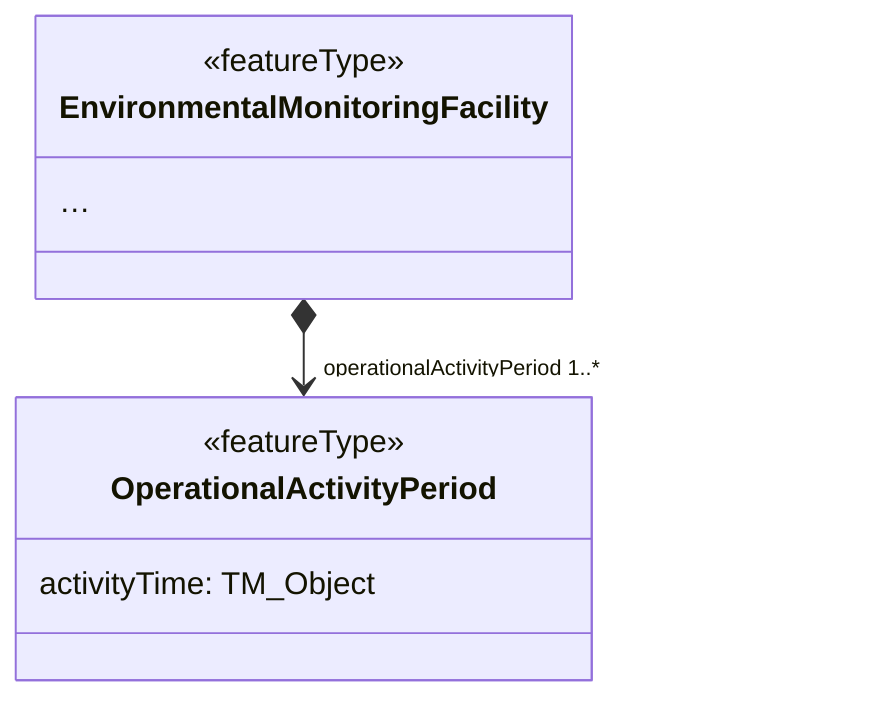
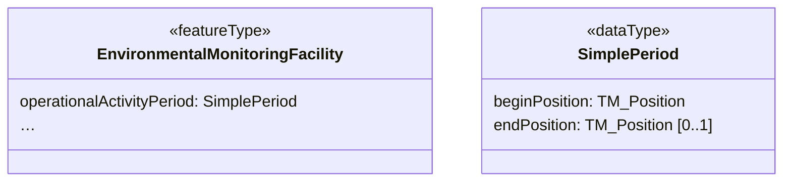

# Simplified Period (MT009)

## Category

substitution rule

## Description

XML has primitive types for times and dates that are well supported
through most software. In INSPIRE and the related ISO standards, a more
powerful but also highly complex model is available that allows to
precisely specify time-related information. This model allows any
subtype of `AbstractTimeObject`, which can include `TimeEdge`,
`TimeInstant`, `TimeNode` and `TimePeriods`. In several themes, such as
EMF, other types build on top of this model, such as
`ef:OperationalActivityPeriod`. Alltogether, this means that relatively
important information tends to be nested very deep in a structure,
making it harder to create and to process.

Within this rule, we substitute these complex structures through a very
simple structure with just two properties:

- beginPosition
- endPosition

Both of these are to use the same definitions for these two properties
as in the original structure. Note that the `endPosition` is optional,
so the simple type can also be used for periods that haven't ended yet.

## Original model



## Transformed model



## Original instance in default GML encoding

```xml
<ef:EnvironmentalMonitoringFacility>
  <!-- ... -->
  <ef:operationalActivityPeriod>
      <ef:OperationalActivityPeriod gml:id="Piezometre.OperationalActivityPeriod.2.06512X0037-STREMY">
          <ef:activityTime>
              <gml:TimePeriod gml:id="TimePeriod.2.225196">
                  <gml:beginPosition>1977-10-08T23:00:00Z</gml:beginPosition>
                  <gml:endPosition>2014-10-14T06:00:00Z</gml:endPosition>
              </gml:TimePeriod>
          </ef:activityTime>
      </ef:OperationalActivityPeriod>
  </ef:operationalActivityPeriod>
  <!-- ... -->
</ef:EnvironmentalMonitoringFacility>
```
   
## Transformed instance in default GML encoding

```xml
<efs:EnvironmentalMonitoringFacility>
  <!-- ... -->
  <efs:operationalActivityPeriod>
      <simple:SimplePeriod>
        <gml:beginPosition>1977-10-08T23:00:00Z</gml:beginPosition>
        <gml:endPosition>2014-10-14T06:00:00Z</gml:endPosition>
      </simple:SimplePeriod>
  </efs:operationalActivityPeriod>
  <!-- ... -->
</efs:EnvironmentalMonitoringFacility>
``` 

## Model transformation rule

### Parameters

- `type`: The type to be substituted, e.g. `OperationalActivityPeriod`.

### Execution

Substitute existing type as indicated by the `type` parameter with the
`SimplePeriod` type.

## Instance transformation rule

### Parameters

N/A

### Execution

- Copy the value of the nested `beginPosition` property to property
  `beginPosition`.
- Copy the value of the nested `endPosition` property to property 
`endPosition`.

## Solved usability issues

The transformed data structure can easily be edited, filtered and symbolized in desktop GIS and web GIS software. This transformation also reduces data volume in datasets.

## Known usability issues

None.

## INSPIRE compliance conditions and reversibility

This rule works only with one external link, and it removed finer grained information about dates. It can be combined with the [Property Composition to Association](./PropertyByReferenceOnly.md) rule to add more information from an external register.

## Notes

N/A